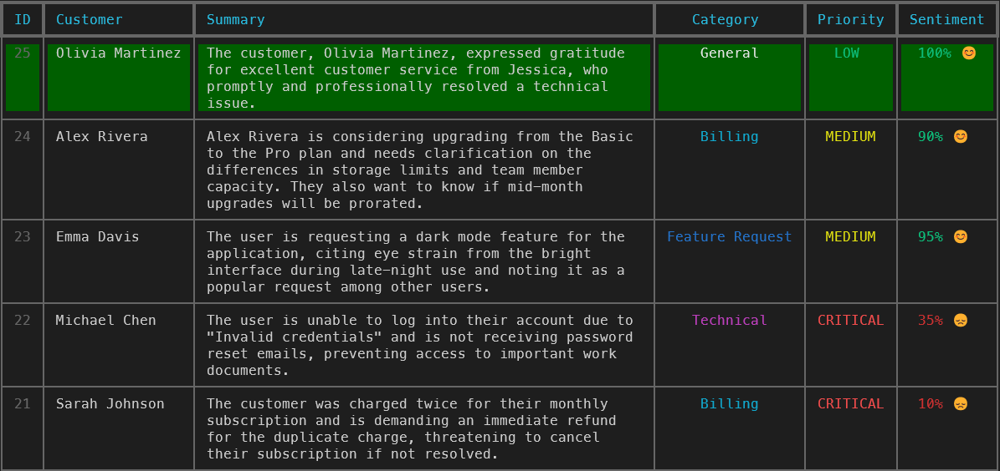

# 🎫 Ticket Classifier Agent

> **AI-powered customer support ticket classification with beautiful CLI visualization**

An intelligent ticket classification system built with **PydanticAI** and **Google Gemini AI** that automatically analyzes support tickets, assigns priorities, detects sentiment, and displays results in a stunning color-coded terminal interface.

<p align="center">
  
</p>

## ✨ Why This Project?

Traditional LLM integrations return unstructured text that's difficult to validate and integrate into production systems. This project demonstrates **type-safe AI agents** for data engineering:

- ✅ **Structured Output** - Pydantic schemas ensure predictable, validated responses
- ✅ **Production Ready** - PostgreSQL storage with proper ENUM types and indexes
- ✅ **Visual Feedback** - Rich CLI tables with color-coded priorities and sentiment
- ✅ **Multiple Input Modes** - CLI args, interactive mode, or sample data
- ✅ **Real-world Ready** - Async architecture with connection pooling

## 🚀 Features

### Intelligent Classification
- **Automatic Categorization** - Billing, Technical, Feature Requests, or General inquiries
- **Smart Priority Assignment** - Low, Medium, High, or Critical based on urgency
- **Sentiment Analysis** - Numerical scoring (0.0 - 1.0) with emoji indicators
- **AI-Powered Summaries** - Concise summaries of ticket content

### Beautiful CLI Interface
- **Color-Coded Priorities** - Critical (🔴 red), High (🟠 orange), Medium (🟡 yellow), Low (🟢 green)
- **Category Colors** - Billing (cyan), Technical (magenta), Feature Request (blue), General (white)
- **Sentiment Display** - Percentage with emojis (😊 positive, 😐 neutral, 😞 negative)
- **Highlighted Rows** - Newly processed tickets appear with green background
- **Multi-line Summaries** - Full text wrapping for complete context

### Type-Safe Architecture
```python
class ProcessedTicket(BaseModel):
    summary: str
    category: Category  # validated enum
    priority: Priority  # validated enum
    sentiment_score: float  # validated 0.0-1.0
```

No more parsing unstructured LLM responses - every output is validated and type-safe!

## 📦 Installation

### Prerequisites
- Python 3.8+
- PostgreSQL 12+
- Google Gemini API key ([Get one here](https://ai.google.dev/))

### Quick Start

```bash
# Clone the repository
git clone https://github.com/Ioannis-Stamatakis/ticket-classifier-agent.git
cd ticket-classifier-agent

# Create virtual environment
python3 -m venv venv
source venv/bin/activate  # Windows: venv\Scripts\activate

# Install dependencies
pip install -r requirements.txt

# Configure environment
cp .env.example .env
# Edit .env with your credentials:
#   GEMINI_API_KEY=your_key_here
#   DB_HOST=localhost
#   DB_PORT=5432
#   DB_NAME=ticket_db
#   DB_USER=your_user
#   DB_PASSWORD=your_password

# Run with sample data
python -m src.main
```

The database schema will be automatically initialized on first run!

## 🎮 Usage

### Process Tickets

**Random Sample Ticket (Default)**
```bash
python -m src.main
```
Processes one random ticket from 5 diverse samples.

**All Sample Tickets**
```bash
python -m src.main --all
```
Processes all 5 built-in samples sequentially - great for demos!

**Your Own Ticket**
```bash
python -m src.main "Subject: Login Issue
Hi, I can't access my account.
Email: john@example.com
Name: John Doe"
```

**Interactive Mode**
```bash
python -m src.main --interactive
```
Multi-line input - type `END` when finished.

### Built-in Sample Tickets

The system includes 5 realistic scenarios:

| Ticket | Category | Priority | Sentiment | Description |
|--------|----------|----------|-----------|-------------|
| 🔴 Billing Error | Billing | CRITICAL | 10% 😞 | Double-charged subscription |
| 🔐 Login Issues | Technical | HIGH | 30% 😞 | Account access problems |
| 🌙 Dark Mode Request | Feature | MEDIUM | 95% 😊 | UI enhancement request |
| 💰 Pricing Question | Billing | LOW | 90% 😊 | Plan upgrade inquiry |
| 💚 Thank You | General | LOW | 100% 😊 | Positive feedback |

## 🏗️ Architecture

### Technology Stack

- **[PydanticAI](https://ai.pydantic.dev/)** - Type-safe AI agent framework
- **[Google Gemini](https://ai.google.dev/)** - gemini-2.5-flash model
- **[PostgreSQL](https://www.postgresql.org/)** - Relational database with custom ENUMs
- **[asyncpg](https://github.com/MagicStack/asyncpg)** - High-performance async PostgreSQL driver
- **[Rich](https://rich.readthedocs.io/)** - Beautiful terminal UI
- **[SQLModel](https://sqlmodel.tiangolo.com/)** - SQL ORM with Pydantic integration

### Data Flow

```
Raw Ticket → PydanticAI Agent → Google Gemini AI → Validated Output → PostgreSQL
                                                           ↓
                                                    Rich Table Display
```

### Project Structure

```
ticket-classifier-agent/
├── src/
│   ├── main.py                # Application entry point
│   ├── agent/
│   │   ├── ticket_agent.py    # PydanticAI agent configuration
│   │   └── tools.py           # Agent tools
│   ├── database/
│   │   ├── connection.py      # Connection pool management
│   │   └── init_schema.sql    # Database schema with ENUMs
│   ├── display/
│   │   └── table_display.py   # Rich CLI table rendering
│   ├── models/
│   │   ├── schemas.py         # Pydantic validation schemas
│   │   └── database.py        # SQLModel tables
│   ├── config/
│   │   └── settings.py        # Configuration management
│   └── utils/
│       └── enums.py           # Shared enumerations
├── scripts/
│   └── add_test_tickets.py    # Populate test data
├── docs/
│   └── screenshot.png         # CLI screenshot
├── requirements.txt           # Python dependencies
├── .env.example               # Environment template
└── README.md                  # This file
```

## 💾 Database Schema

### Custom ENUM Types
```sql
CREATE TYPE priority_enum AS ENUM ('low', 'medium', 'high', 'critical');
CREATE TYPE category_enum AS ENUM ('billing', 'technical', 'feature_request', 'general');
```

### Tables

**customers**
- `id` (UUID, PRIMARY KEY)
- `email` (VARCHAR, UNIQUE)
- `name` (VARCHAR)
- `created_at` (TIMESTAMP)

**tickets**
- `id` (UUID, PRIMARY KEY)
- `customer_id` (UUID, FOREIGN KEY)
- `raw_content` (TEXT)
- `summary` (TEXT)
- `category` (category_enum)
- `priority` (priority_enum)
- `sentiment_score` (FLOAT)
- `created_at` (TIMESTAMP)

### Optimized Indexes
- `idx_tickets_customer_id` - Fast customer lookups
- `idx_tickets_category` - Filter by category
- `idx_tickets_priority` - Filter by priority
- `idx_customers_email` - Email lookups

## 🔧 Configuration

### Environment Variables

| Variable | Description | Required |
|----------|-------------|----------|
| `GEMINI_API_KEY` | Google Gemini API key | ✅ Yes |
| `DB_HOST` | PostgreSQL host | ✅ Yes |
| `DB_PORT` | PostgreSQL port | ✅ Yes |
| `DB_NAME` | Database name | ✅ Yes |
| `DB_USER` | Database user | ✅ Yes |
| `DB_PASSWORD` | Database password | ✅ Yes |

### Database Connection Features
- ✅ Automatic URL encoding for special characters in passwords
- ✅ SSL configuration based on server support
- ✅ Connection pooling for optimal performance
- ✅ Idempotent schema initialization

## 🎯 Key Implementation Patterns

### Type-Safe Agent Responses

Instead of parsing unstructured text:
```python
# ❌ Traditional approach
response = "This ticket is urgent and about billing"
# Now you need to parse this...
```

You get validated, structured data:
```python
# ✅ PydanticAI approach
result = await agent.run(ticket_text)
result.output.priority    # "critical" (validated enum)
result.output.category    # "billing" (validated enum)
result.output.sentiment   # 0.15 (validated float 0.0-1.0)
```

### PostgreSQL ENUM Integration

```python
# Python enums match SQL types exactly
class Priority(str, Enum):
    LOW = "low"
    MEDIUM = "medium"
    HIGH = "high"
    CRITICAL = "critical"

# Database queries use explicit type casting
INSERT INTO tickets (..., priority, ...)
VALUES ($1, $2::priority_enum, ...)
```

### Rich CLI Rendering

```python
# Color-coded display with wrapping
await display_recent_tickets(
    pool=pool,
    limit=5,
    highlight_id=new_ticket_id  # Green background
)
```

## 🧪 Testing

### Run Test Data Script
```bash
python scripts/add_test_tickets.py
```

This populates the database with 6 diverse tickets covering:
- Critical billing issues
- Technical login problems
- Feature requests
- General inquiries
- Positive feedback

## 🚧 Troubleshooting

### Common Issues

**"GoogleModel got an unexpected keyword argument 'api_key'"**
- Set `GEMINI_API_KEY` as environment variable, not constructor parameter

**"PostgreSQL server rejected SSL upgrade"**
- Set `ssl=False` in connection settings (handled automatically)

**"Unknown Customer" in output**
- Include customer info in ticket: `Email: user@example.com` and `Name: Full Name`

**Database connection errors**
- Verify PostgreSQL is running
- Check credentials in `.env`
- Ensure special characters in password are handled (automatic URL encoding)

## 🛣️ Roadmap

- [ ] REST API endpoint for ticket submission
- [ ] Real-time streaming analysis
- [ ] Batch processing for multiple tickets
- [ ] Enhanced agent tools for database operations
- [ ] Comprehensive test suite
- [ ] Database migrations with Alembic
- [ ] Multi-language support
- [ ] Analytics dashboard
- [ ] Customer feedback integration

## 📚 Learn More

### Key Concepts

**PydanticAI Benefits:**
- Type-safe AI responses validated at runtime
- Seamless integration with data pipelines
- Production-ready with proper error handling
- Structured output for reliable automation

**Why This Matters:**
Traditional LLM integrations are unpredictable. PydanticAI + proper type validation = AI agents you can trust in production data engineering workflows.

### Resources

- [PydanticAI Documentation](https://ai.pydantic.dev/)
- [Google Gemini AI](https://ai.google.dev/)
- [Rich Terminal UI](https://rich.readthedocs.io/)
- [asyncpg Documentation](https://magicstack.github.io/asyncpg/)

## 🤝 Contributing

Contributions are welcome! This project demonstrates type-safe AI for data engineering. Feel free to:

- Report bugs or suggest features via [Issues](https://github.com/Ioannis-Stamatakis/ticket-classifier-agent/issues)
- Submit Pull Requests with improvements
- Share your use cases and implementations

## 📄 License

This project is available under the MIT License.

## 🙏 Acknowledgments

- Built with [PydanticAI](https://ai.pydantic.dev/) by Pydantic
- Powered by [Google Gemini AI](https://ai.google.dev/)
- UI by [Rich](https://rich.readthedocs.io/) by Will McGugan
- Inspired by the need for type-safe, production-ready AI agents

---

<p align="center">
  <strong>Made with ❤️ for type-safe AI engineering</strong>
</p>

<p align="center">
  If you find this project helpful, please ⭐ star it on GitHub!
</p>
